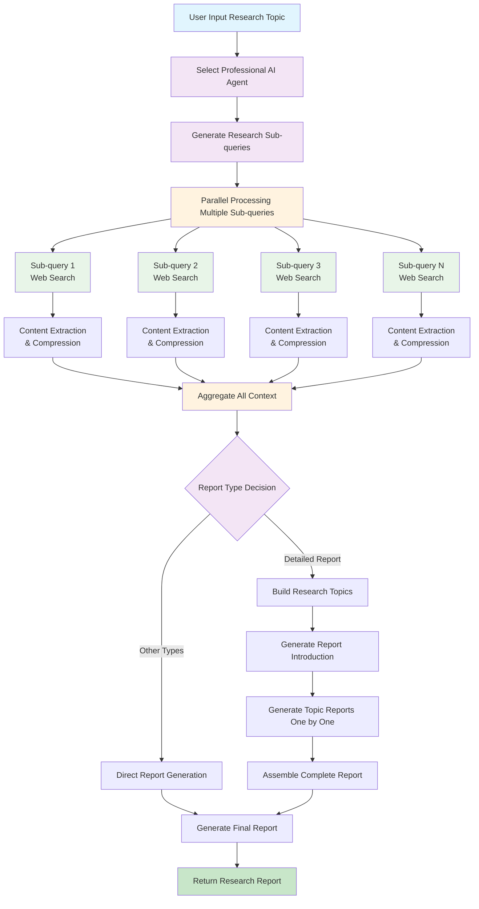

# 🔍 Lite Research

[中文版本](README_zh.md) | English

An AI-powered research tool built with large language models to assist users in conducting in-depth topic research and report generation.

## 📖 Project Background

This project is based on learning and practicing with the [gpt-researcher](https://github.com/assafelovic/gpt-researcher) project. During the study of its architecture and implementation logic, this simplified version was developed.

Lite Research retains the core concept of the original project—intelligent information retrieval and report generation through AI agents—but simplifies the implementation by removing some complex functional modules, making the code structure clearer and more comprehensible.

The main purpose of developing this project is to learn and practice the architectural design of AI-driven research tools, gaining deep understanding of how such systems work through actual coding.

## ✨ Key Features

- **🎯 Intelligent Agent Selection**: Automatically selects appropriate AI agent roles based on research topics
- **🔍 Sub-query Generation**: Automatically generates multiple related sub-queries for comprehensive research coverage
- **⚡ Parallel Information Retrieval**: Processes multiple queries simultaneously for efficient web information gathering
- **🧠 Context Compression**: Uses vectorization techniques to extract the most relevant content
- **📄 Report Generation**: Generates structured research reports with support for multiple types and tones
- **📊 LLM Monitoring**: Integrates Langfuse to monitor all AI calls, providing detailed performance analysis and cost tracking

## 🚀 Quick Start

### Requirements

- Python 3.12+
- UV (Python package management tool)
- Dependencies (managed via `pyproject.toml`)

### Installation Steps

1. **Clone the repository**
   ```bash
   git clone https://github.com/i-richardwang/literesearch.git
   cd literesearch
   ```

2. **Install dependencies**
   ```bash
   uv sync
   ```

3. **Configure environment variables**
   ```bash
   # Copy environment template
   cp env.example .env
   
   # Edit .env file and add necessary API keys
   ```

   **Required Configuration**:
   ```bash
   # LLM Configuration
   OPENAI_API_KEY_DEEPSEEK=your_deepseek_api_key_here
   OPENAI_API_BASE_DEEPSEEK=https://api.deepseek.com/v1
   
   # Search Configuration
   TAVILY_API_KEY=your_tavily_api_key_here
   
   # Embedding Model Configuration
   EMBEDDING_API_KEY=your_embedding_api_key_here
   EMBEDDING_API_BASE=https://api.example.com/v1/embeddings
   ```

   **Optional Configuration - Langfuse Monitoring**:
   ```bash
   # Langfuse Monitoring (Optional)
   LANGFUSE_SECRET_KEY=your_langfuse_secret_key_here
   LANGFUSE_PUBLIC_KEY=your_langfuse_public_key_here
   LANGFUSE_HOST=https://cloud.langfuse.com  # Optional, defaults to cloud version
   ```

4. **Start the application**
   ```bash
   uv run run_app.py
   ```
   
   Or directly with Streamlit:
   ```bash
   uv run streamlit run frontend/literesearch_app.py
   ```

### How to Use

1. Open `http://localhost:8501` in your browser
2. Enter your research topic in the input field
3. Select report type and tone
4. Adjust advanced settings (optional)
5. Click the "Start Research" button
6. Wait for AI to generate the research report
7. Download the report in Markdown format

## 📊 LLM Monitoring (Optional)

This project integrates Langfuse to monitor LLM calls. To enable monitoring functionality, configure the following environment variables:

```bash
# Langfuse Monitoring (Optional)
LANGFUSE_SECRET_KEY=your_langfuse_secret_key_here
LANGFUSE_PUBLIC_KEY=your_langfuse_public_key_here
LANGFUSE_HOST=https://cloud.langfuse.com  # Optional, defaults to cloud version
```

Get API keys: Visit [Langfuse Cloud](https://cloud.langfuse.com) to create a project and obtain keys.

**Note**: Monitoring functionality is completely optional and does not affect core research functionality.

## 📊 Report Types

- **📊 Comprehensive Research Report**: Complete analysis and summary
- **📚 Resource Summary Report**: Related materials and reference list
- **📝 Research Outline**: Main points and structural framework
- **📋 Detailed In-depth Report**: Comprehensive and thorough analysis
- **⚙️ Custom Report**: Customized according to specific requirements
- **🔬 Sub-topic Report**: In-depth analysis of specific sub-topics

## 🎨 Tone Options

- **Formal**: Academic and business report style
- **Informal**: Easy-to-read and relaxed style
- **Analytical**: Deep analysis oriented
- **Persuasive**: Convincing expression
- **Informative**: Objective information delivery
- **Explanatory**: Detailed explanation and illustration

## ⚙️ Advanced Settings

- **Maximum Sub-queries**: Controls research breadth (1-10)
- **Maximum Sub-topics**: Controls detailed report depth (1-10)
- **Maximum Results per Query**: Controls information volume (1-20)

## 🔄 Backend Execution Logic



### Core Component Description

- **Professional Agent Selection**: Intelligently matches the most suitable AI expert roles based on research topics (such as financial analysts, technical experts, etc.)
- **Sub-query Generation**: Breaks down topics into multiple related search questions to ensure comprehensive research
- **Parallel Information Retrieval**: Processes multiple sub-queries simultaneously to improve research efficiency
- **Intelligent Content Processing**: Automatically extracts web content and uses vectorization techniques to filter the most relevant information
- **Report Generation**: Generates structured professional research reports based on different report type requirements

## 🛠️ Technology Stack

- **Frontend**: Streamlit
- **Backend**: Python, LangChain
- **AI Models**: OpenAI GPT series
- **Search Engine**: Tavily API
- **Vectorization**: OpenAI Embeddings
- **Monitoring**: Langfuse (optional)

## 📁 Project Structure

```
literesearch/
├── frontend/                 # Frontend application
│   ├── literesearch_app.py   # Main application (core functionality logic)
│   ├── ui_components.py     # UI components and style definitions
│   └── assets/             # Static resource files
├── backend/                 # Backend core
│   └── literesearch/        # Literature research module
├── utils/                  # Utility functions
│   ├── llm_tools.py       # LLM utility classes
│   └── langfuse_tools.py  # Langfuse monitoring tools
├── run_app.py             # Launch script
├── pyproject.toml        # Project configuration and dependency list
├── uv.lock              # UV lock file
└── README.md             # Documentation
```

### 🏗️ Code Architecture

**Modular Design**:
- `literesearch_app.py`: Core functionality logic, handling user interaction and AI research workflow
- `ui_components.py`: UI components and styling, responsible for interface display and user experience
- Clear separation of responsibilities for easy maintenance and extension

**Core Functional Modules**:
- Research setup and parameter configuration
- AI research workflow control
- Report generation and download
- Exception handling and user feedback
- LLM call monitoring and analysis

## 🤝 Contributing

Welcome to submit Issues and Pull Requests to improve the project!

### Development Guide

1. For UI-related modifications, edit `frontend/ui_components.py`
2. For functionality logic modifications, edit `frontend/literesearch_app.py`
3. Backend AI logic is located in `backend/literesearch/`
4. Monitoring tools are located in `utils/langfuse_tools.py`

## 📄 License

This project is licensed under the MIT License.

## 📞 Contact

- Author: Richard Wang
- GitHub: https://github.com/i-richardwang/literesearch

---

**Tip**: First-time setup requires configuring the corresponding API keys. Please ensure that the `.env` file contains necessary configuration information. Langfuse monitoring is an optional feature and does not affect the use of core research functionality.